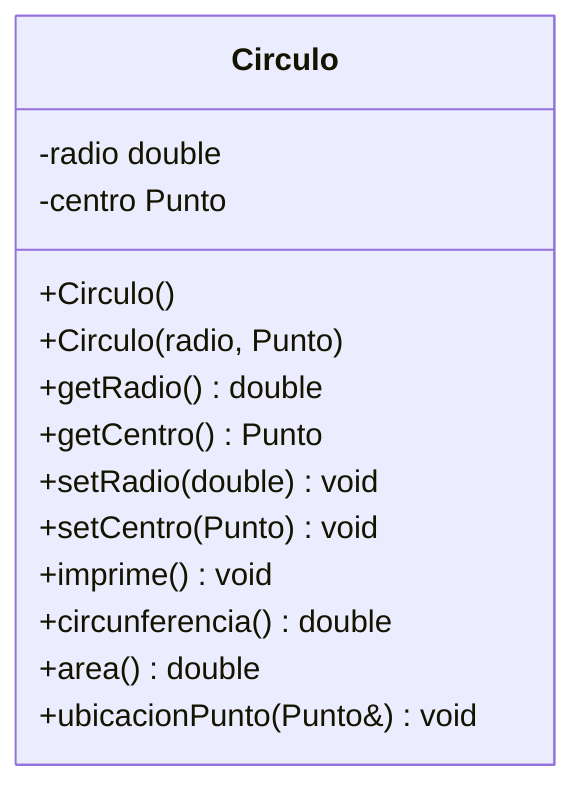

# Ejercicio - Composicion

Este repositorio está preparado para la creación de la clase Circulo que tiene composición con Punto para definir la coordenada del centro del círculo.

Se realizará la clase círculo de acuerdo al siguiente diagrama de clases:


- El área se calcula con la fórmula **pi*radio^2**
- La circunferencia se calcula con la fórmula **pi*diametro**
- El método de **ubicacionPunto** nos dice si el Punto ingresado está *dentro* del círculo, *fuera* del círculo o *sobre* el círculo (sobre la circunferencia).

**Notas:**
Este proyecto tiene la estructura básica para cualquier proyecto C++. 

La carpeta contiene el código fuente y el archivo de construcción ```make```.

La carpeta `build` contiene el codigo binario generado por el archivo de construcción ```make```.

Consulta el archivo assignments/README.md de fuera de la carpeta Composición para instrucciones sobre la compilación y ejecución del proyecto.